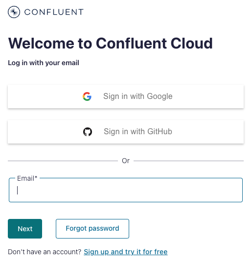
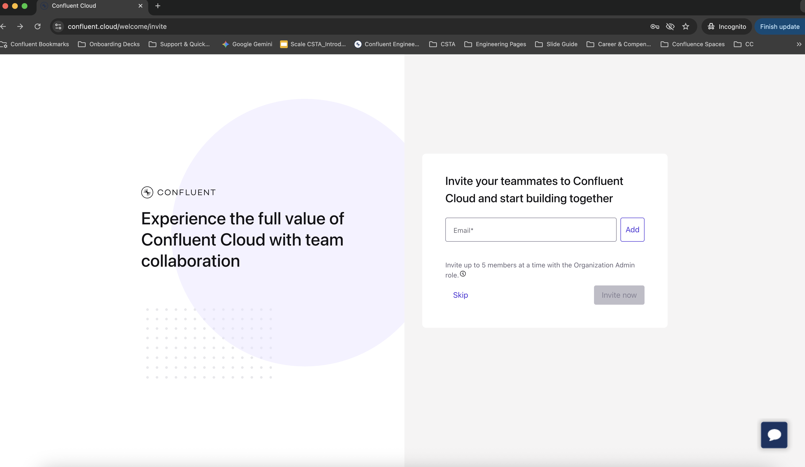
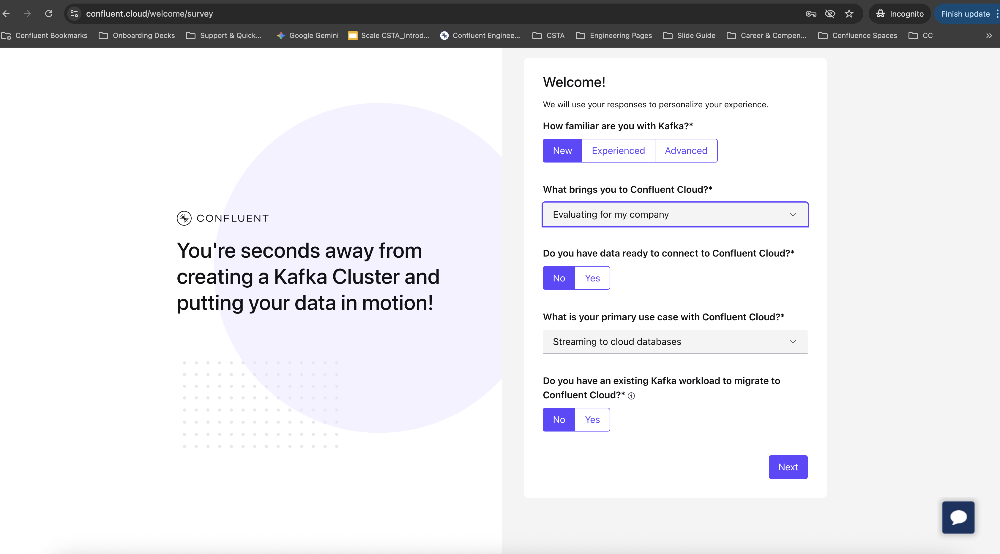
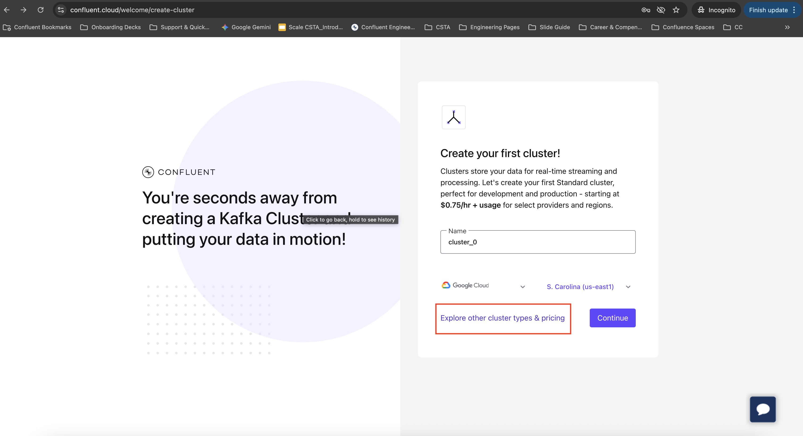
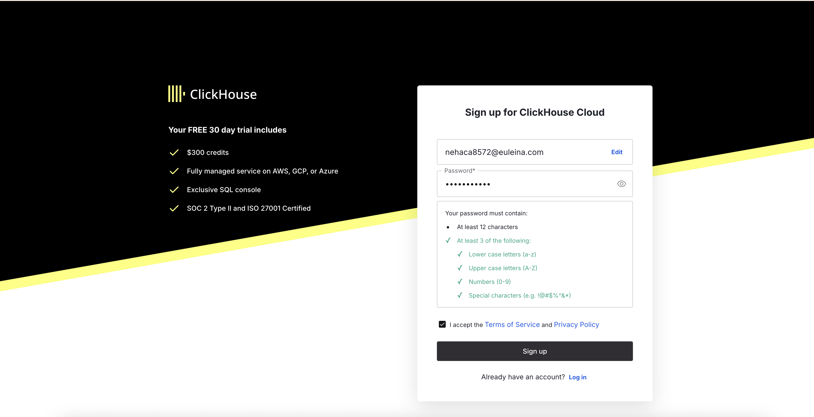
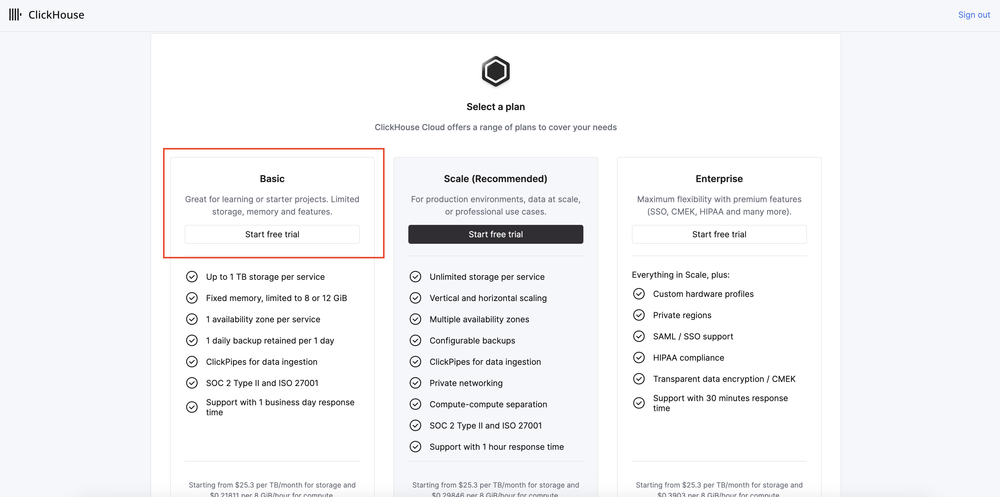
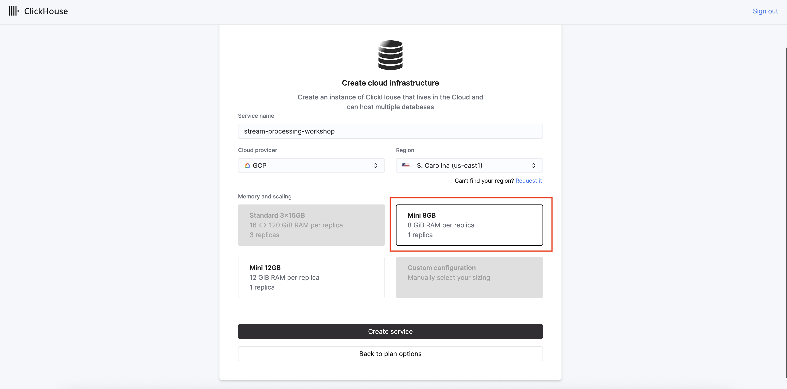
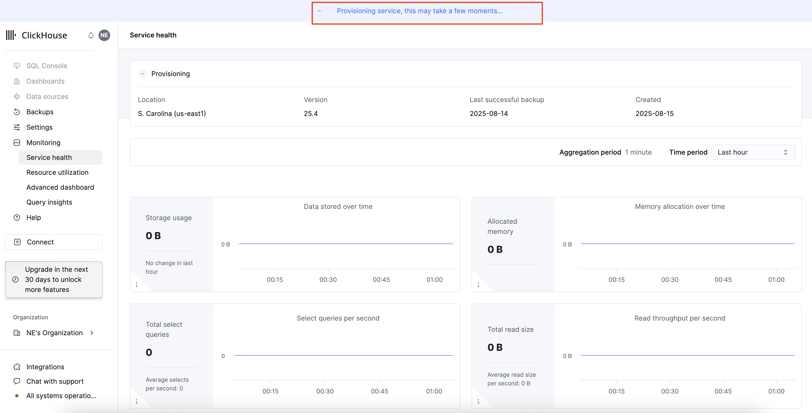
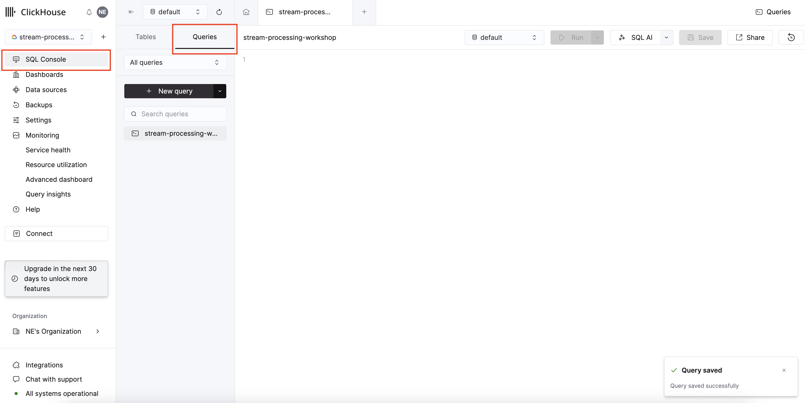

    

# 
Stream Processing Workshop: Pre-work

Welcome to the Stream Processing Workshop! To make sure we can hit the ground running, please complete the following setup tasks **before** the workshop begins. This should take you about 15-20 minutes.

## **Workshop Objective**

To gain hands-on experience building an end-to-end, real-time analytics pipeline. By the end of this workshop, you will know how to use Confluent Cloud to ingest data streams, process and transform that data in real-time with Apache Flink, and perform instant, powerful analysis using ClickHouse.

*** 

## Workshop Prework

1. [Create Confluent Cloud Account](#step-1)
2. [Create ClickHouse Cloud Account](#step-2)
3. [Watch Stream Processing Intro Videos](#step-3)

***

##  1. Set Up Your Confluent Cloud Account ☁️

1. Create a Confluent Cloud Account.
    - Sign up for a Confluent Cloud account [here](https://www.confluent.io/confluent-cloud/tryfree/).
    - You will receive a confirmation email. **Please verify your email address** and log back into your Confluent Cloud account.

2. Log into [Confluent Cloud](https://confluent.cloud) and enter your email and password.

    

2. If you are logging in for the first time, you will see a self-guided wizard that walks you through spinning up a cluster. Please minimize this as you will walk through those steps in this workshop.

3. Skip Teammate Invites. After your first login, you will be asked to invite teammates. For this workshop, you can simply click **Skip**.

    

4. Complete the Welcome Survey. You will see a short survey to personalize your experience. You can select any options you like (the image shows some common examples) and then click **Next**.

    

5. Stop at the "Create cluster" Screen. You will land on the "Create your first cluster" page. **You can stop here!** We will complete the cluster creation and the rest of the setup together during the live workshop session. our screen should look like this. Once you see it, your Confluent Cloud pre-work is complete.

    

***

##  2. Set Up Your ClickHouse Cloud Account ⚡

Our real-time analytical database will be **ClickHouse Cloud**. Follow these steps to create your free trial account and set up the service we'll use in the workshop.

1. Sign up for ClickHouse Cloud

Navigate to the [ClickHouse Cloud sign-up page](https://clickhouse.com/cloud). Enter your email, create a secure password, accept the terms, and click **Sign up**.

    

---

2. Select the "Basic" Plan

On the plan selection screen, choose the **Basic** plan and click **Start free trial**. This plan is more than sufficient for our workshop and includes a generous free trial.

    

---

3. Configure Your Service**

Now, let's configure your cloud infrastructure. It is **very important** to use the exact service name so our workshop scripts work correctly.

* **Service name**: `stream-processing-workshop`
* **Cloud provider**: You can leave the default (e.g., GCP).
* **Region**: Select a region close to you (e.g., `S. Carolina (us-east1)`).
* **Memory and scaling**: Select the **Mini 8GB** option.

Once configured, click **Create service**.

    

---

4. Wait for Provisioning**

The service will now be provisioned. This may take a few moments. You'll see a notification bar at the top indicating that the service is being created.

    

---

5. Setup Complete!

Once provisioning is complete, you will be taken to your service dashboard. You can navigate to the **SQL Console** to see the query editor.

**Congratulations!** Your ClickHouse Cloud service is now set up and ready for the workshop.

    

##  3. Watch Introduction to Stream Processing & Data Streaming Videos 🎬

To familiarize yourself with the basic concepts, please watch these short introductory videos. They provide a great overview of what stream processing is and why it's important.

* **Action:** Watch the following videos:
    1.  [What is Stream Processing?](https://www.youtube.com/watch?v=ya4298V8Mqo)
    2.  [What is Data Streaming](https://www.youtube.com/watch?v=SLHCfIUTYZI)

---

If you have any questions or run into any issues during the setup, please don't hesitate to reach out.

See you at the workshop!